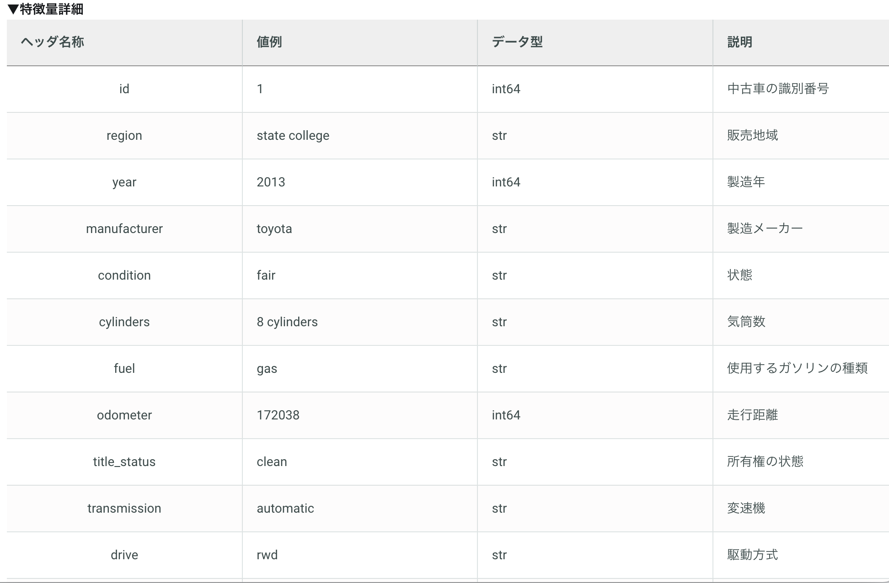
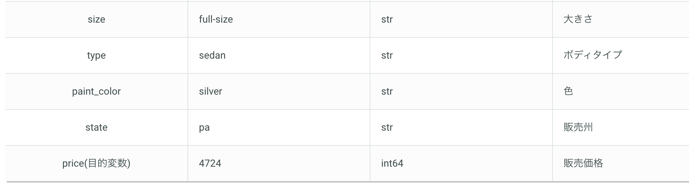

# SIGNATE_StdCup_2023

ディレクトリ ツリー
```
.
├── README.md
├── data
│   ├── submit_sample.csv
│   ├── test.csv
│   └── train.csv
└── nb
    └── Untitled.ipynb
```
## Paper
|No.|Status|Name|Detail|Date|Url|
|---|---|---|---|---|---|

## Basics
**Overview**

### 配布データ
- 学習用データ（train.csv）
- 評価用データ（test.csv）
- 応募用サンプルファイル（submit_sample.csv）
<br>

<br>


## Log
### 20230811
- join!!
- 
